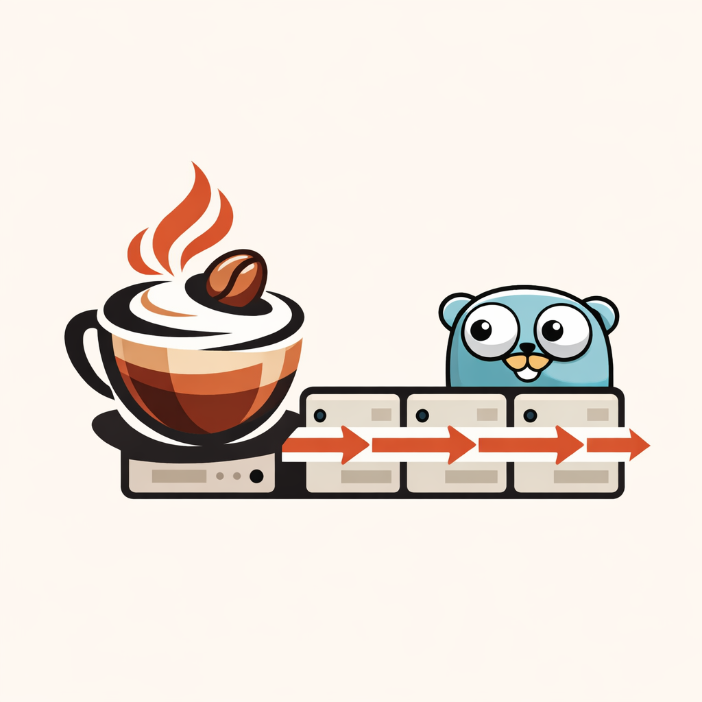

<p align="center">
  
</p>

<h1 align="center">Moca</h1>

<p align="center">
  A metadata-driven, multitenant, full-stack business application framework built in Go.
</p>

<p align="center">
  
  
  
  
</p>

---


Moca is a spiritual successor to the [Frappe](https://frappeframework.com/) framework (the engine behind [ERPNext](https://erpnext.com/)), redesigned from scratch with Go, PostgreSQL, and React. A single **MetaType** definition drives database schema, validation, document lifecycle, permissions, API generation, search indexing, and UI rendering.

## Why Moca?

| Frappe Limitation | Moca Improvement |
|---|---|
| Rigid, non-customizable auto-generated API | Fully customizable API layer with middleware, versioning, GraphQL |
| Python GIL limits concurrency | Go goroutines for true parallel request handling |
| MariaDB-centric | PostgreSQL with JSONB, CTEs, window functions, partitioning |
| Monolithic process model | Decomposable into microservices when needed |
| Limited real-time capabilities | WebSocket pub/sub + Kafka event streaming built-in |
| Tightly coupled Desk UI | Decoupled React frontend consuming a metadata API |
| Implicit hook ordering | Explicit priority-ordered hook registry with dependency resolution |

## Technology Stack

| Layer | Technology |
|-------|-----------|
| Backend | Go 1.22+ |
| Frontend | React 19+ with TypeScript |
| Database | PostgreSQL 16+ (schema-per-tenant, JSONB, RLS) |
| Cache / Queue | Redis 7+ (cache + Redis Streams for jobs) |
| Event Streaming | Apache Kafka (optional; Redis pub/sub fallback) |
| Search | Meilisearch |
| Object Storage | S3-compatible (MinIO) |
| Reverse Proxy | Caddy / NGINX |

## Project Structure

```
cmd/                  # Binary entry points
  moca/               #   CLI tool (Cobra)
  moca-server/        #   HTTP + WebSocket server
  moca-worker/        #   Background job consumer
  moca-scheduler/     #   Cron scheduler
  moca-outbox/        #   Transactional outbox poller
pkg/                  # Core framework packages
  meta/               #   MetaType registry & schema compiler
  document/           #   Document lifecycle & validation
  api/                #   REST + GraphQL gateway
  orm/                #   PostgreSQL adapter & query builder
  auth/               #   Session, JWT, OAuth2, permissions
  hooks/              #   Hook registry & event system
  workflow/           #   State machine, SLA timers, approvals
  tenancy/            #   Site resolver & multitenancy middleware
  queue/              #   Redis Streams producer/consumer
  events/             #   Kafka producer/consumer & outbox
  search/             #   Meilisearch indexer
  storage/            #   S3/MinIO adapter
  observe/            #   Prometheus, OpenTelemetry, logging
apps/core/            # Core framework doctypes (User, Role, DocType, etc.)
desk/                 # React 19 + TypeScript frontend SPA
spikes/               # Architecture validation prototypes (MS-00)
docs/                 # Design documents & milestone plans
```

## Key Architectural Decisions

- **Schema-per-tenant** — each tenant gets its own PostgreSQL schema, enforced via `pgxpool BeforeAcquire` resetting `search_path` on every connection
- **MetaType-driven** — every MetaType auto-generates table DDL, CRUD routes, GraphQL schema, search index config, and React views
- **`_extra` JSONB column** — every document table includes a dynamic field column, avoiding schema migrations for customizations
- **Transactional outbox** — DB writes and event publishing kept consistent via an outbox table polled by `moca-outbox`
- **Hook registry with explicit priorities** — app hooks declare numeric priority and dependency order

## Documentation

| Document | Description |
|----------|-------------|
| [Roadmap](ROADMAP.md) | 30-milestone roadmap to v1.0 (~72 weeks), dependency graph, critical path |
| [System Design](MOCA_SYSTEM_DESIGN.md) | Full framework architecture — MetaType, Document Runtime, API, permissions, hooks, workflows, database, frontend, multitenancy, observability |
| [CLI Design](MOCA_CLI_SYSTEM_DESIGN.md) | CLI tool architecture — 152 commands across 23 command groups |
| [Database Decision](docs/moca-database-decision-report.md) | ADR: PostgreSQL 16+ with schema-per-tenant over CockroachDB |
| [Blocker Resolutions](docs/blocker-resolution-strategies.md) | Solutions for 4 critical architectural blockers |
| [Cross-Doc Review](docs/moca-cross-doc-mismatch-report.md) | Cross-document consistency review (30 resolved mismatches) |

## Current Status

Moca is in the **design and planning phase**. Implementation begins at **MS-00: Architecture Validation Spikes**, which establishes the Go workspace, build system, CI pipeline, and validates 5 high-risk architectural assumptions through spike prototypes.

See the [Roadmap](ROADMAP.md) for the full 30-milestone plan to v1.0.

## License

TBD
